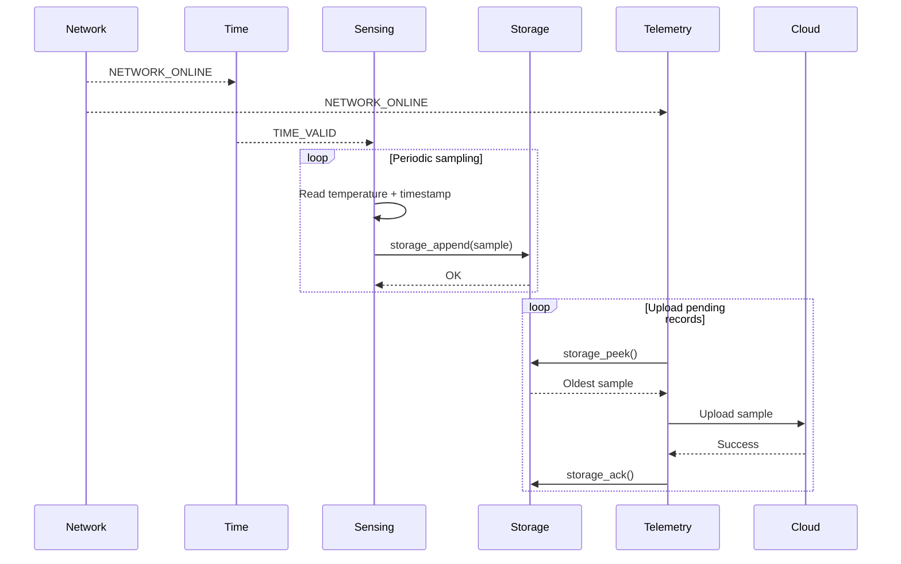

```mermaid
sequenceDiagram
    participant Network
    participant Time
    participant Sensing
    participant Storage
    participant Telemetry
    participant Cloud

    Network-->>Time: NETWORK_ONLINE
    Network-->>Telemetry: NETWORK_ONLINE

    Time-->>Sensing: TIME_VALID

    loop Periodic sampling
        Sensing->>Sensing: Read temperature + timestamp
        Sensing->>Storage: storage_append(sample)
        Storage-->>Sensing: OK
    end

    loop Upload pending records
        Telemetry->>Storage: storage_peek()
        Storage-->>Telemetry: Oldest sample
        Telemetry->>Cloud: Upload sample
        Cloud-->>Telemetry: Success
        Telemetry->>Storage: storage_ack()
    end
```