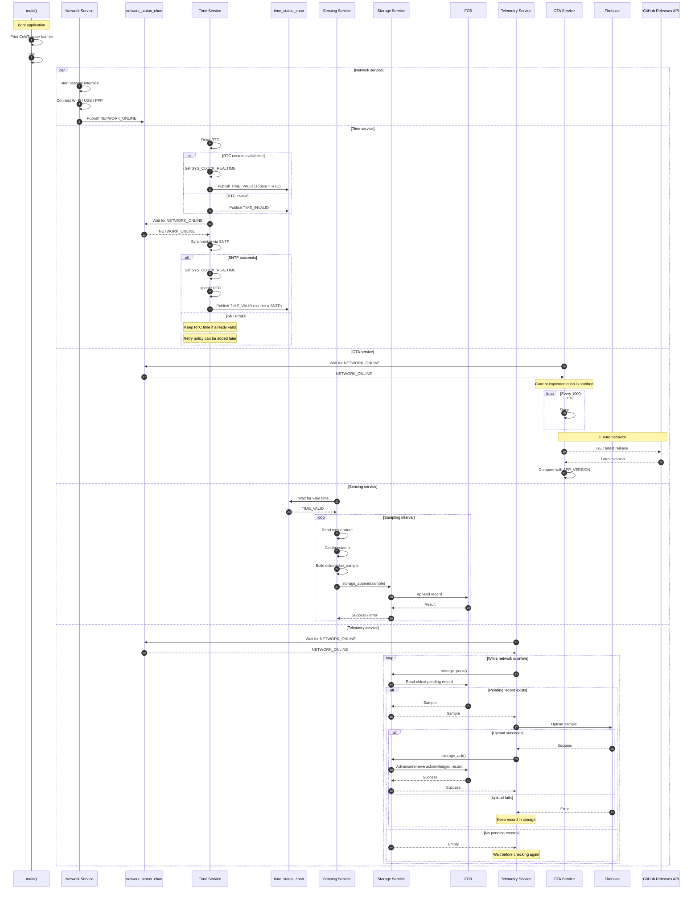

```mermaid
sequenceDiagram
    autonumber

    participant Main as main()
    participant Network as Network Service
    participant NetChan as network_status_chan
    participant Time as Time Service
    participant TimeChan as time_status_chan
    participant Sensing as Sensing Service
    participant Storage as Storage Service
    participant FCB as FCB
    participant Telemetry as Telemetry Service
    participant OTA as OTA Service
    participant Firebase as Firebase
    participant GitHub as GitHub Releases API

    Note over Main: Boot application
    Main->>Main: Print ColdTracker banner
    Main->>Main: Idle

    par Network service
        Network->>Network: Start network interface
        Network->>Network: Connect Wi-Fi / USB / PPP
        Network->>NetChan: Publish NETWORK_ONLINE
    and Time service
        Time->>Time: Read RTC

        alt RTC contains valid time
            Time->>Time: Set SYS_CLOCK_REALTIME
            Time->>TimeChan: Publish TIME_VALID (source = RTC)
        else RTC invalid
            Time->>TimeChan: Publish TIME_INVALID
        end

        Time->>NetChan: Wait for NETWORK_ONLINE
        NetChan-->>Time: NETWORK_ONLINE

        Time->>Time: Synchronize via SNTP

        alt SNTP succeeds
            Time->>Time: Set SYS_CLOCK_REALTIME
            Time->>Time: Update RTC
            Time->>TimeChan: Publish TIME_VALID (source = SNTP)
        else SNTP fails
            Note over Time: Keep RTC time if already valid
            Note over Time: Retry policy can be added later
        end

    and OTA service
        OTA->>NetChan: Wait for NETWORK_ONLINE
        NetChan-->>OTA: NETWORK_ONLINE

        Note over OTA: Current implementation is stubbed
        loop Every 1000 ms
            OTA->>OTA: Sleep
        end

        Note over OTA,GitHub: Future behavior
        OTA-->>GitHub: GET latest release
        GitHub-->>OTA: Latest version
        OTA->>OTA: Compare with APP_VERSION

    and Sensing service
        Sensing->>TimeChan: Wait for valid time
        TimeChan-->>Sensing: TIME_VALID

        loop Sampling interval
            Sensing->>Sensing: Read temperature
            Sensing->>Sensing: Get timestamp
            Sensing->>Sensing: Build coldtracker_sample

            Sensing->>Storage: storage_append(sample)
            Storage->>FCB: Append record
            FCB-->>Storage: Result
            Storage-->>Sensing: Success / error
        end

    and Telemetry service
        Telemetry->>NetChan: Wait for NETWORK_ONLINE
        NetChan-->>Telemetry: NETWORK_ONLINE

        loop While network is online
            Telemetry->>Storage: storage_peek()
            Storage->>FCB: Read oldest pending record

            alt Pending record exists
                FCB-->>Storage: Sample
                Storage-->>Telemetry: Sample

                Telemetry->>Firebase: Upload sample

                alt Upload succeeds
                    Firebase-->>Telemetry: Success
                    Telemetry->>Storage: storage_ack()
                    Storage->>FCB: Advance/remove acknowledged record
                    FCB-->>Storage: Success
                    Storage-->>Telemetry: Success
                else Upload fails
                    Firebase-->>Telemetry: Error
                    Note over Telemetry: Keep record in storage
                end

            else No pending records
                Storage-->>Telemetry: Empty
                Note over Telemetry: Wait before checking again
            end
        end
    end
```